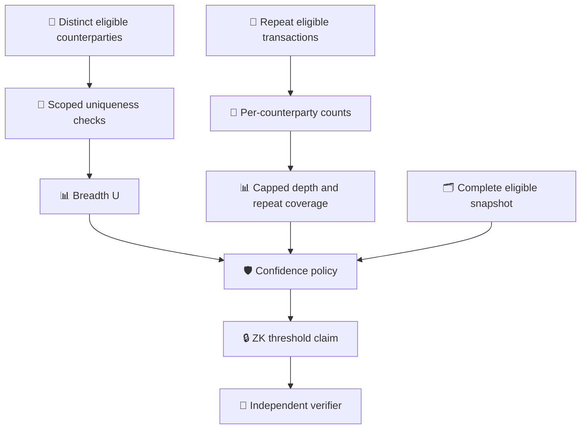

# Relationship diversity confidence

> Conceptual flow; cryptographic mechanism not selected.

```mermaid
flowchart TD
 A["👥 Distinct eligible counterparties"] --> B["🔎 Scoped uniqueness checks"]
 C["🤝 Repeat eligible transactions"] --> D["🔢 Per-counterparty counts"]
 B --> E["📊 Breadth U"]
 D --> F["📊 Capped depth and repeat coverage"]
 E --> G["🛡️ Confidence policy"]
 F --> G
 H["🗂️ Complete eligible snapshot"] --> G
 G --> I["🔒 ZK threshold claim"]
 I --> J["🏪 Independent verifier"]
```

Weighting is evidence confidence, not proof of non-collusion.
