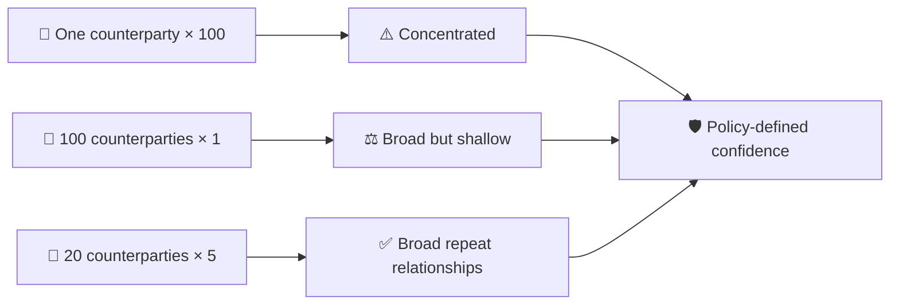

# Relationship pattern comparison

```mermaid
flowchart LR
 A["👤 One counterparty × 100"] --> D["⚠️ Concentrated"]
 B["👥 100 counterparties × 1"] --> E["⚖️ Broad but shallow"]
 C["👥 20 counterparties × 5"] --> F["✅ Broad repeat relationships"]
 D --> G["🛡️ Policy-defined confidence"]
 E --> G
 F --> G
```

Qualitative policy goal only. Counterparty identities and transactions must be eligible and authentic; collusion remains possible.
